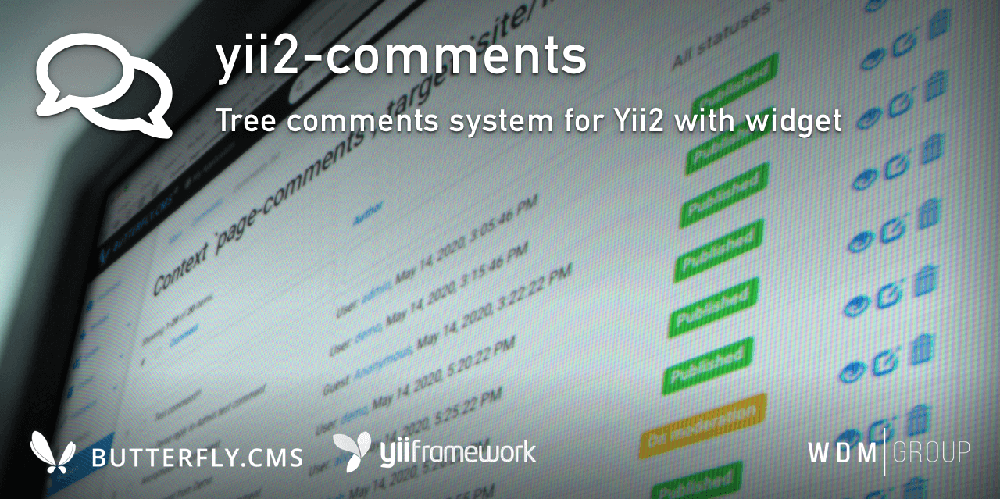

# Yii2 Comments Module
Tree comments system for Yii2 with widget. The functionality of the module allows you to manage user comments with pre-moderation or automatic approval for registered users.

This module is an integral part of the [Butterfly.СMS](https://butterflycms.com/) content management system, but can also be used as an standalone extension.

Copyrights (c) 2019-2021 [W.D.M.Group, Ukraine](https://wdmg.com.ua/)

# Requirements 
* PHP 5.6 or higher
* Yii2 v.2.0.40 and newest
* [Yii2 Base](https://github.com/wdmg/yii2-base) module (required)
* [Yii2 SelectInput](https://github.com/wdmg/yii2-selectinput) widget
* [Yii2 Users](https://github.com/wdmg/yii2-users) module (optionaly)

# Installation
To install the module, run the following command in the console:

`$ composer require "wdmg/yii2-comments"`

After configure db connection, run the following command in the console:

`$ php yii comments/init`

And select the operation you want to perform:
  1) Apply all module migrations
  2) Revert all module migrations

# Migrations
In any case, you can execute the migration and create the initial data, run the following command in the console:

`$ php yii migrate --migrationPath=@vendor/wdmg/yii2-comments/migrations`

# Configure
To add a module to the project, add the following data in your configuration file:

    'modules' => [
        ...
        'comments' => [
            'class' => 'wdmg\comments\Module',
            'routePrefix' => "admin",
            'defaultController' => "admin/comments/default",
            'baseRoute' => "/comments",
            'defaultListView' => "@vendor/wdmg/yii2-comments/widgets/views/_list",
            'defaultFormView' => "@vendor/wdmg/yii2-comments/widgets/views/_form",
            'editCommentTimeout' => 300,
            'deleteCommentTimeout' => 3600,
            'newCommentsModeration' => true,
            'approveFromRegistered' => true
        ],
        ...
    ],

# Usecase
Use the CommentsWidget::widget() to render comment`s list by context and target.

    <?php
        echo \wdmg\comments\widgets\CommentsWidget::widget([
            'context' => 'page-comments',
            'target' => 'site/index'
        ]);
    ?>

# Routing
Use the `Module::dashboardNavItems()` method of the module to generate a navigation items list for NavBar, like this:

    <?php
        echo Nav::widget([
        'options' => ['class' => 'navbar-nav navbar-right'],
            'label' => 'Modules',
            'items' => [
                Yii::$app->getModule('comments')->dashboardNavItems(),
                ...
            ]
        ]);
    ?>

# Status and version [ready to use]
* v.1.0.2 - Fixed mysql syntax error: 1055 for >= MySQL 5.7
* v.1.0.1 - Update README.md
* v.1.0.0 - Default controller for frontend
* v.0.0.11 - Added pagination, up to date dependencies
* v.0.0.10 - Fixed deprecated class declaration
* v.0.0.9 - Added extra options to composer.json and navbar menu icon
* v.0.0.8 - Added choice param for non interactive mode
